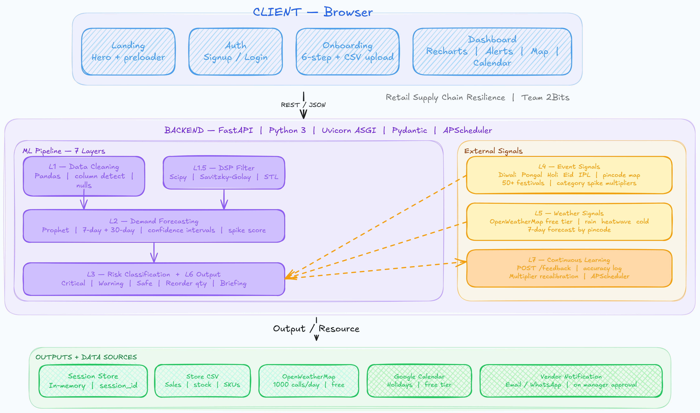

# XYRA — Predict the rush. Never run out.

> **Technoverse Hackathon 2026** · Team 2Bits · Domain: Retail · Theme: Supply Chain Resilience

We came across the domain **Retail** and the problem statement **Supply Chain Resilience** and immediately saw a gap that no one was solving affordably — small and mid-size Indian retailers losing ₹1.2 Trillion every year to stockouts and dead inventory, with zero access to the kind of AI tools that Walmart and large enterprises use. That became XYRA.

We have built the **core backend ML pipeline** (7 layers — data cleaning, DSP filtering, demand forecasting, risk classification, event signals, weather signals, and a continuous learning loop) and the **complete frontend flow** is live and viewable at the link below.

**Live Frontend:** [https://xyra-cognizant.vercel.app/](https://xyra-cognizant.vercel.app/)

---

## The Idea

India's retail industry bleeds revenue through two silent killers — **stockouts** (empty shelves that turn customers away) and **dead inventory** (overstocked goods that lock up working capital). The root cause is not poor management. It is zero visibility into what is coming.

68% of small and mid-size Indian retailers still rely on manual stock checks and gut instinct. Demand spikes from local festivals, IPL matches, heatwaves, and regional events go completely undetected until shelves are already empty.

**XYRA** is an AI-powered supply chain assistant that:

- Ingests a store's historical sales CSV
- Pulls live local event data by pincode (Diwali, Pongal, Holi, Eid, IPL season, and 50+ more)
- Monitors weather disruptions (rain, heatwaves, cold snaps) via OpenWeatherMap
- Uses a 7-layer ML pipeline to predict demand spikes per product category
- Classifies every SKU as Critical / Warning / Safe with days-to-stockout
- Identifies the best available vendor and places a reorder — pending one-click manager approval
- Learns from manager feedback over time to recalibrate its own predictions

No complex setup. No IT team. No legacy integration. Upload a CSV and get actionable intelligence in seconds.

---

## Why This Problem Is Worth Solving

| Metric | Data |
|---|---|
| Global AI in Retail Inventory Market | $6.70B (2024) → $33.60B by 2034 at 17.7% CAGR |
| Small & mid retailers in India | 15M+ with zero affordable AI tools |
| Lost annually to supply chain inefficiencies | ₹1.2 Trillion |
| Stockout reduction with AI forecasting | Up to 35% |
| Excess inventory reduction | Up to 28% |
| Enterprise tools cost | $200+/user/month (Oracle, Blue Yonder) |
| XYRA cost | Under ₹3,000/store/month |
| ROI breakeven | 8–10 weeks |

---

## Tech Stack

**Frontend**
- React 19 · TypeScript 5.8 · Vite 6
- TailwindCSS 4 · Recharts · Motion · React Router 7
- Lucide React · clsx

**Backend**
- Python 3 · FastAPI · Uvicorn (ASGI)
- Pandas · NumPy · SciPy · Prophet · Scikit-learn
- Pydantic · APScheduler
- OpenWeatherMap API · Google Calendar API

---

## The 7-Layer ML Pipeline

```
Layer 1   →  Data Ingestion & Cleaning        Pandas · column detection · null fill · deduplication
Layer 1.5 →  DSP Noise Filtering              Scipy · Z-score · IQR clipping · Savitzky-Golay · STL decomposition
Layer 2   →  Demand Forecasting               Prophet · 7-day + 30-day · confidence intervals · spike score
Layer 3   →  Risk Classification              Critical / Warning / Safe · reorder quantity formula
Layer 4   →  Event Signals                    50+ Indian festivals · pincode to region mapping · category multipliers
Layer 5   →  Weather Signals                  OpenWeatherMap free tier · rain · heatwave · cold snap rules
Layer 6   →  Output & Recommendations         Risk dashboard · reorder actions · plain-English weekly briefing
Layer 7   →  Continuous Learning              Manager feedback loop · accuracy log · multiplier recalibration
```

---

## System Architecture

<!-- Add your system architecture image below -->



---

## REST API Endpoints

| Method | Endpoint | Description |
|--------|----------|-------------|
| POST | `/upload-csv` | Upload store sales CSV, triggers full pipeline |
| GET | `/session/{id}/dashboard` | Risk-classified product dashboard |
| GET | `/session/{id}/recommendations` | Top reorder actions with quantities |
| GET | `/session/{id}/briefing` | Plain-English weekly manager briefing |
| POST | `/feedback` | Manager accepts/rejects recommendation |
| GET | `/event-signals` | Upcoming Indian festival multipliers by pincode |
| GET | `/weather-signals` | Weather-based demand adjustments by pincode |
| GET | `/learning-stats` | Model accuracy and feedback history |
| GET | `/health` | Health check |

---
<!-- 
## Project Structure

```
xyra/
├── frontend/                  # React + TypeScript + Vite
│   ├── src/
│   │   ├── pages/             # Landing, Auth, Onboarding, Dashboard
│   │   └── components/        # Reusable UI components
│   └── package.json
├── backend/                   # FastAPI + Python
│   ├── main.py                # All API endpoints
│   ├── layers/
│   │   ├── layer1_cleaner.py
│   │   ├── layer1_5_dsp.py
│   │   ├── layer2_forecaster.py
│   │   ├── layer3_classifier.py
│   │   ├── layer4_events.py
│   │   ├── layer5_weather.py
│   │   ├── layer6_output.py
│   │   └── layer7_learning.py
│   └── requirements.txt
├── vercel.json
└── README.md
``` -->

---

## Running Locally

**Frontend**
```bash
cd frontend
npm install
npm run dev
```

**Backend**
```bash
cd backend
pip install -r requirements.txt
uvicorn main:app --reload
```

The backend runs on `http://localhost:8000` and the frontend on `http://localhost:5173`.

---

## Research Backing

- [1] O. R. Amosu et al., "AI-driven demand forecasting: Enhancing inventory management and customer satisfaction," *World Journal of Advanced Research and Reviews*, vol. 23, no. 2, pp. 708–719, 2024. doi: 10.30574/wjarr.2024.23.2.2394
- [2] S. K. R. Malikireddy, "Enhancing retail supply chain resilience with generative AI," *World Journal of Advanced Engineering Technology and Sciences*, vol. 9, no. 1, pp. 399–409, 2023. doi: 10.30574/wjaets.2023.9.1.0172
- [3] P. Yadav, "Demand forecasting in retail using machine learning and big data," *IJARCCE*, vol. 14, no. 2, pp. 274–278, Feb. 2025. doi: 10.17148/IJARCCE.2025.14235
- [4] J. Jones, "AI-driven demand forecasting in supply chains: A qualitative analysis," *Preprints.org*, Jan. 2025. doi: 10.20944/preprints202501.1349.v1
- [5] [Online]. Available: https://www.sciencedirect.com/science/article/pii/S2773067025000202
- [6] C.-J. Lu and C.-C. Chang, "A hybrid sales forecasting scheme combining ICA with K-means clustering and SVR," *The Scientific World Journal*, vol. 2014, Art. no. 624017, 2014. doi: 10.1155/2014/624017
- [7] A. Chauhan, "Retail store inventory forecasting dataset," *Kaggle*, 2024. Available: https://kaggle.com/datasets/anirudhchauhan/retail-store-inventory-forecasting-dataset

---

## Team

**Team 2Bits** · Technoverse Hackathon 2026 · Cognizant  
Domain: Retail · Theme: Supply Chain Resilience

---

*XYRA — Predict the rush. Never run out.*
